  

  Desenvolvedor Full Stack com foco em aplicações web, APIs robustas e interfaces limpas, sempre priorizando clareza, manutenção e boa experiência de uso.

  
  
  
  

 

  
  

## Sobre

- Desenvolvimento de soluções web com foco em organização, legibilidade e consistência visual.
- Experiência com back-end em `Python` e `.NET`, além de interfaces em `React` e `TypeScript`.
- Interesse em produtos bem acabados, arquitetura prática e automações que simplificam o fluxo de trabalho.

## Stack principal

  

  

