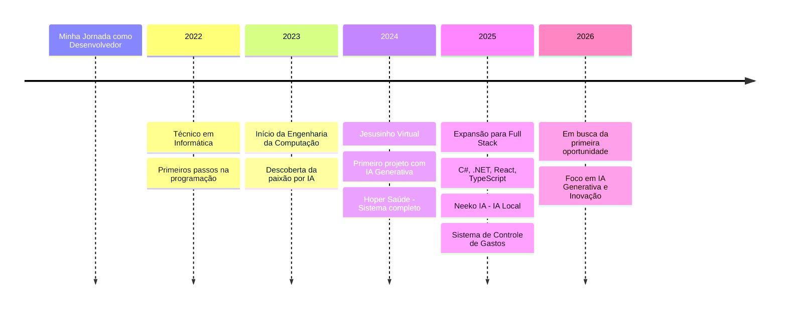

  

  
  

  
  

---

  
  <h1 align="center">
    
    Olá, eu sou <a href="https://github.com/Bragabyte"><strong>Felipe Braga Ribeiro</strong></a>
    
  </h1>
  
  <h3 align="center">
    
    <strong>Bragabyte</strong> — Desenvolvedor Full Stack em Formação
    
  </h3>

---

  
  

---

## 🎯 Sobre Mim

  Sou estudante de <strong>Engenharia da Computação</strong> e Técnico em Informática, em jornada constante de aprendizado e evolução como desenvolvedor. Minha paixão está em criar <strong>tecnologia com propósito</strong> — soluções que não apenas funcionam, mas que fazem a diferença na vida das pessoas.

  Atualmente, estou focado em <strong>Inteligência Artificial Generativa</strong>, <strong>Desenvolvimento Web Full Stack</strong> e <strong>Automação</strong>. Acredito que a tecnologia, quando desenvolvida com ética e propósito, pode ser uma ferramenta poderosa para transformar positivamente o mundo.

  Meus valores — fé, ética, criatividade e excelência — são o alicerce de cada projeto que desenvolvo. Busco minha primeira oportunidade profissional para aplicar meu conhecimento, aprender com os melhores e contribuir significativamente para uma equipe inovadora.

---

## 🚀 Projetos em Destaque

### 🤖 Jesusinho Virtual

  <strong>Assistente virtual cristão com IA</strong> — Projeto que une tecnologia e fé para oferecer apoio espiritual. Desenvolvi uma solução completa com memória de conversa, voz natural e interface amigável, utilizando múltiplas APIs de IA para proporcionar experiências significativas.

  
  
  
  
  

---

### 🏥 Hoper Saúde

  <strong>Assistente inteligente para orientação em saúde</strong> — Sistema completo com chat inteligente, busca de postos de saúde via Google Maps API e cadastro de usuários. Desenvolvi tanto o backend com FastAPI quanto o frontend, integrando Firebase Firestore para persistência de dados.

  
  
  
  
  
  

---

### 🦊 Neeko IA

  <strong>Assistente utilizando Ollama</strong> — Interface moderna para chat com LLMs locais, permitindo IA offline com privacidade total. Desenvolvi uma solução que democratiza o acesso à IA generativa sem dependência de conexão constante com a nuvem.

  
  
  

---

### 🤖 Carrinho Autônomo ESP32

  <strong>Robótica e IoT</strong> — Projeto de carrinho autônomo com ESP32, sensores ultrassônicos e controle via Bluetooth. Implementei modos manual e automático, explorando a intersecção entre hardware e software para criar soluções físicas inteligentes.

  
  
  
  

---

### 💰 Sistema de Controle de Gastos

  <strong>Projeto Full Stack completo</strong> — Sistema financeiro com backend em C# e ASP.NET Core, frontend em React com TypeScript, e banco de dados SQLite. Desenvolvi APIs REST, dashboard interativo e funcionalidades completas de gestão financeira.

  
  
  
  
  
  

---

### 🚨 Botão de Emergência

  <strong>Automação para segurança</strong> — Sistema que integra WhatsApp e Telegram para envio rápido de mensagens de emergência com localização. Desenvolvi uma solução que pode salvar vidas através da automação inteligente.

  
  
  

---

### 🌐 Site Jovens Discípulos

  <strong>Portal para grupo de jovens</strong> — Website responsivo com design moderno, integrado a outros projetos. Desenvolvi uma presença digital profissional para comunidade, focando em UX e acessibilidade.

  
  
  

---

### 🎨 Portfólio Pessoal

  <strong>Landing Page profissional</strong> — Website responsivo apresentando meus projetos e habilidades. Desenvolvi uma vitrine digital moderna que destaca minha evolução como desenvolvedor.

  
  
  

---

## 💻 Tecnologias

### Linguagens

  
  
  
  
  
  

### Frontend

  
  
  
  
  

### Backend

  
  
  
  

### Banco de Dados

  
  
  
  

### Inteligência Artificial

  
  
  
  
  
  

### Ferramentas

  
  
  
  
  
  

### Cloud & Deploy

  
  

### Embarcados & IoT

  
  
  
  

---

## 📈 Minha Jornada

---

## 🎯 Objetivos Profissionais

  <strong>Curto Prazo:</strong> Conquistar minha primeira oportunidade profissional em tecnologia, preferencialmente em empresas inovadoras que valorizem aprendizado contínuo e desenvolvimento de soluções com impacto real.

  <strong>Médio Prazo:</strong> Especializar-me em Inteligência Artificial Generativa e Desenvolvimento Full Stack, contribuindo para projetos que transformem a maneira como as pessoas interagem com a tecnologia.

  <strong>Longo Prazo:</strong> Tornar-me um referência em desenvolvimento de soluções éticas com IA, criando tecnologias que sirvam ao bem-estar humano e promovam acessibilidade e inclusão.

---

## 🌟 Por que me contratar?

<table>
  <tr>
    <td width="50%">
      <h3>✨ Aprendizado Contínuo</h3>
      

        Tenho curiosidade natural e dedicação para aprender novas tecnologias rapidamente. Meu portfólio demonstra evolução constante e capacidade de adaptação.
      

    </td>
    <td width="50%">
      <h3>🎯 Propósito</h3>
      

        Desenvolvo tecnologia com propósito. Cada projeto que crio visa resolver problemas reais e melhorar a vida das pessoas.
      

    </td>
  </tr>
  <tr>
    <td width="50%">
      <h3>🤖 Inovação com IA</h3>
      

        Paixão por Inteligência Artificial Generativa e suas aplicações práticas. Já desenvolvi múltiplos projetos utilizando diferentes APIs e modelos.
      

    </td>
    <td width="50%">
      <h3>💪 Full Stack</h3>
      

        Capacidade de trabalhar em todo o ciclo de desenvolvimento, desde o backend até o frontend, com experiência em múltiplas tecnologias.
      

    </td>
  </tr>
</table>

---

## 📬 Contato

  Estou sempre aberto a novas oportunidades, colaborações e conversas sobre tecnologia!

  
  
  
  

---

  
  <strong>Obrigado por visitar meu perfil!</strong>
  

  <em>"Codificando com propósito, inovando com ética, transformando com tecnologia."</em>

  

---

  

