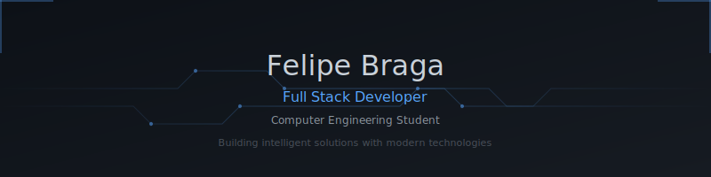

# Felipe Braga

<em id="typing">Building intelligent solutions with modern technologies</em>

---

## About

Computer Engineering student focused on Full Stack Development and Artificial Intelligence. I build robust REST APIs, automate workflows, and create scalable solutions using modern technologies.

---

## Tech Stack

---

