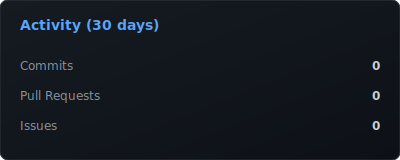

<em>Desenvolvendo soluções inteligentes com tecnologias modernas.</em>

---

## 👨‍💻 Sobre

Sou estudante de **Engenharia da Computação**, apaixonado por **Desenvolvimento Full Stack**, **Inteligência Artificial** e **Automação**. Gosto de desenvolver APIs, aplicações escaláveis e soluções que resolvem problemas reais, sempre buscando aprender novas tecnologias e evoluir como desenvolvedor.

---

## 🚀 Tecnologias

---

