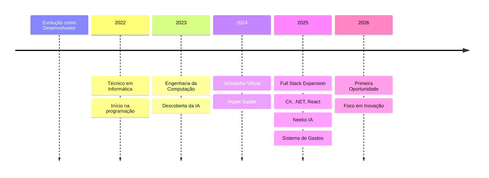

 

 

 

 

---

<h1>
  Felipe Braga Ribeiro
</h1>

<h3>
  Full Stack Developer em Formação | Engenharia da Computação
</h3>

  
  
  

---

## Sobre

Estudante de Engenharia da Computação e Técnico em Informática, focado em desenvolver soluções tecnológicas com propósito real. Minha jornada é marcada pela curiosidade constante e pela busca por criar aplicações que gerem impacto positivo na vida das pessoas.

Atualmente, estou concentrando meus estudos em Inteligência Artificial Generativa, Desenvolvimento Web Full Stack e Automação. Acredito que a tecnologia, quando desenvolvida com ética e intencionalidade, pode ser uma ferramenta poderosa para transformar realidades.

Busco minha primeira oportunidade profissional para aplicar meu conhecimento em um ambiente inovador, aprender com profissionais experientes e contribuir significativamente para projetos que fazem a diferença.

---

## Stack Principal

<table>
  <tr>
    <td align="center" width="100">
      
       
      Python
    </td>
    <td align="center" width="100">
      
       
      C#
    </td>
    <td align="center" width="100">
      
       
      .NET
    </td>
    <td align="center" width="100">
      
       
      React
    </td>
    <td align="center" width="100">
      
       
      TypeScript
    </td>
    <td align="center" width="100">
      
       
      FastAPI
    </td>
  </tr>
</table>

---

## Projetos em Destaque

### Hoper Saúde

Sistema completo de assistente inteligente para orientação em saúde, com chat integrado, busca de postos de saúde via Google Maps API e cadastro de usuários. Desenvolvi o backend com FastAPI e o frontend, integrando Firebase Firestore para persistência de dados.

**Tecnologias:** FastAPI, Firebase, Firestore, Google Maps API, HTML, CSS, JavaScript

---

### Jesusinho Virtual

Assistente virtual cristão com Inteligência Artificial, unindo tecnologia e fé para oferecer apoio espiritual. Solução completa com memória de conversa, voz natural com gTTS e interface amigável, utilizando múltiplas APIs de IA.

**Tecnologias:** Python, FastAPI, OpenAI, OpenRouter, Hugging Face, gTTS

---

### Sistema de Controle de Gastos

Aplicação Full Stack completa para gestão financeira pessoal. Backend em C# com ASP.NET Core, frontend em React com TypeScript, banco de dados SQLite. APIs REST, dashboard interativo com gráficos de receitas, despesas e saldo.

**Tecnologias:** C#, ASP.NET Core, Entity Framework Core, React, TypeScript, SQLite

---

### Neeko IA

Interface moderna para chat com LLMs locais utilizando Ollama, permitindo Inteligência Artificial offline com privacidade total. Solução que democratiza o acesso à IA generativa sem dependência de conexão constante com a nuvem.

**Tecnologias:** Python, Ollama, Local LLMs

---

### Carrinho Autônomo ESP32

Projeto de robótica e IoT com carrinho autônomo controlado por ESP32. Sensores ultrassônicos para detecção de obstáculos, servo motor para direção, controle via Bluetooth com modos manual e automático.

**Tecnologias:** ESP32, Arduino, C++, Bluetooth, Sensores Ultrassônicos

---

### Botão de Emergência

Sistema de automação para segurança que integra WhatsApp e Telegram para envio rápido de mensagens de emergência com compartilhamento de localização. Solução desenvolvida para salvar vidas através da automação inteligente.

**Tecnologias:** Python, WhatsApp API, Telegram API

---

### Site Jovens Discípulos

Portal web responsivo para grupo de jovens com design moderno e integração com outros projetos. Desenvolvi uma presença digital profissional para comunidade, focando em UX, acessibilidade e performance.

**Tecnologias:** HTML5, CSS3, JavaScript

---

### Portfólio Pessoal

Landing page profissional e responsiva apresentando meus projetos e habilidades. Vitrine digital moderna que destaca minha evolução como desenvolvedor, com design clean e focado em conversão.

**Tecnologias:** HTML5, CSS3, JavaScript

---

## Tecnologias

### Linguagens

### Frontend

### Backend

### Banco de Dados

### Inteligência Artificial

### Ferramentas

### Cloud & Deploy

### Embarcados & IoT

---

## Atualmente Aprendendo

- C# e ASP.NET Core avançado
- React + TypeScript patterns
- Arquitetura de Software e Clean Code
- Docker e containerização
- Engenharia de Prompt e IA Generativa
- Testes automatizados

---

## Projetos em Desenvolvimento

- **Estudos em C# e ASP.NET Core** - Aprofundamento em desenvolvimento enterprise com .NET
- **React + TypeScript** - Construção de aplicações frontend escaláveis e type-safe
- **Arquitetura de Software** - Estudo de padrões de projeto, SOLID e arquiteturas modernas
- **Docker** - Containerização de aplicações para ambientes de produção
- **IA Generativa** - Exploração de novas APIs e modelos para aplicações inovadoras

---

## Objetivos para 2026

- Conquistar primeira oportunidade profissional em tecnologia
- Contribuir para projetos open-source relevantes
- Desenvolver aplicações de IA com impacto social
- Expandir conhecimento em arquitetura de sistemas
- Construir network com profissionais da área

---

## Curiosidades sobre Mim

- Técnico em Informática formado
- Estudante de Engenharia da Computação
- Apaixonado por unir tecnologia e propósito
- Acredito que código pode transformar vidas
- Sempre buscando aprender algo novo
- Valorizo ética e propósito em cada projeto

---

## Minha Jornada

---

## Vamos Conversar

Estou aberto a oportunidades, colaborações e conversas sobre tecnologia. Se você está buscando um desenvolvedor apaixonado por criar soluções com propósito, vamos conectar!

---

  <strong>Obrigado por visitar meu perfil</strong>

  <em>Desenvolvendo tecnologia com propósito, inovando com ética.</em>

