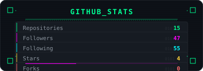
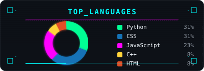

  
  

---

  <h1 style="font-size: 32px; margin: 0; color: #00FF94;">Felipe Braga</h1>
  
ENGENHARIA DA COMPUTAÇÃO | FULL STACK | AI ENTHUSIAST

  
"Transformando ideias em sistemas inteligentes"

  
  
  
  
  

---

  <table>
    <tr>
      <td width="32%" valign="top">
        

          <h3 style="color: #00FF94; margin: 0 0 8px 0; font-size: 14px;">Sobre mim</h3>
          

            • Engenharia da Computação 
            • Full Stack Developer 
            • Python, FastAPI, React 
            • IA e sistemas inteligentes
          

        

      </td>
      <td width="32%" valign="top">
        

          <h3 style="color: #FF00FF; margin: 0 0 8px 0; font-size: 14px;">Stack</h3>
          

            <strong style="color: #00FFFF;">Front:</strong> React • TS • JS • Tailwind 
            <strong style="color: #00FFFF;">Back:</strong> Python • FastAPI • C# • .NET 
            <strong style="color: #00FFFF;">DB:</strong> PostgreSQL • SQLite • Firebase 
            <strong style="color: #00FFFF;">IA:</strong> OpenAI • ML • RAG 
            <strong style="color: #00FFFF;">Tools:</strong> Git • Docker • Linux
          

        

      </td>
      <td width="32%" valign="top">
        

          <h3 style="color: #00FFFF; margin: 0 0 8px 0; font-size: 14px;">Projetos</h3>
          

            🧠 <strong style="color: #F0F6FC;">Hoper Saúde</strong> 
            IA + FastAPI + Firebase  
            🤖 <strong style="color: #F0F6FC;">Jesusinho Virtual</strong> 
            IA + voz + memória
          

        

      </td>
    </tr>
  </table>

  

